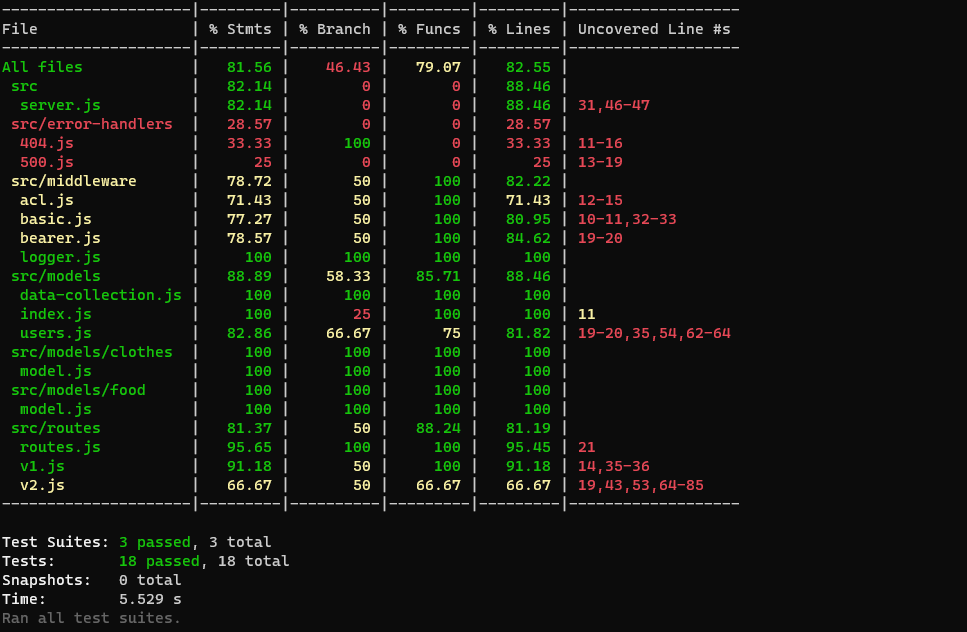
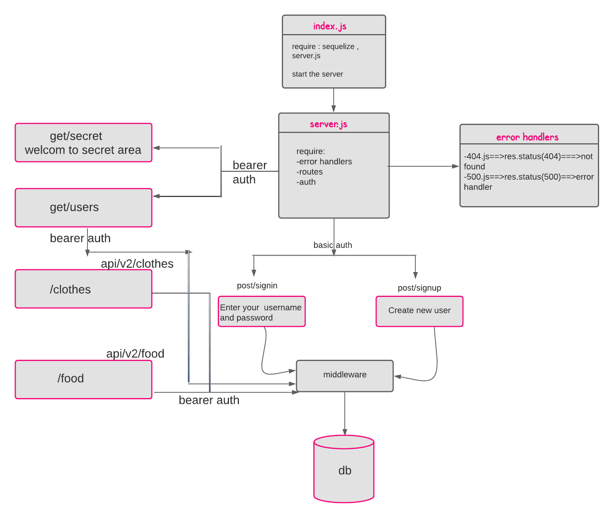

**auth-api**

**Author: Khalid hamedi**

It is a server compines between api-server and auth-server, but controlling access at a more granular level is vital to creating a scalable system. In this lab, you will implement Role Based Access Control (RBAC) using an Access Control List (ACL), allowing to not only restrict access to routes for valid users, but also based on the individual permissions we give each user.

**How to Build?**

Create a new repo and go to action then select node.js workflow for CI.

Clone it to your local machine and create Package.json and add server.js and index.js.

Install the backages.

follow the design pattern in the repo and write your own code.

**Links and Resources:**

[Heroku](https://khalidsy-auth-api.herokuapp.com/)

[Github Actions](https://github.com/khalidsy90/auth-api/actions)

[pull request](https://github.com/khalidsy90/auth-api/pull/1)

**Setup**

---

**.env requirements :**

- PORT=3020
- DATABASE_URL=postgres://localhost:5432/authapi
- SECRET=javaScript

---

**Dependencies needs to install**

    * npm init -y
    * npm i dotenv express cors sequelize sequelize-cli jsonwebtoken morgan postgres sqlite3
    * npm i -D jest supertest

---

**Testing**

---

**UML/Application**

